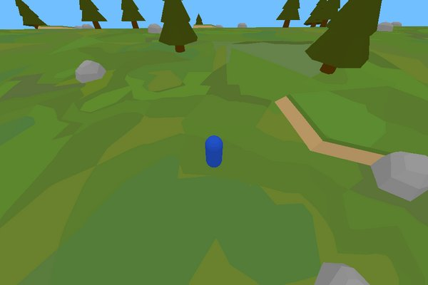
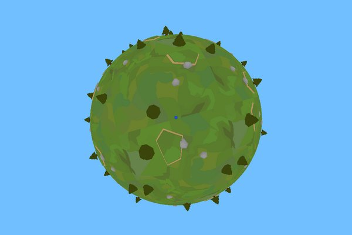
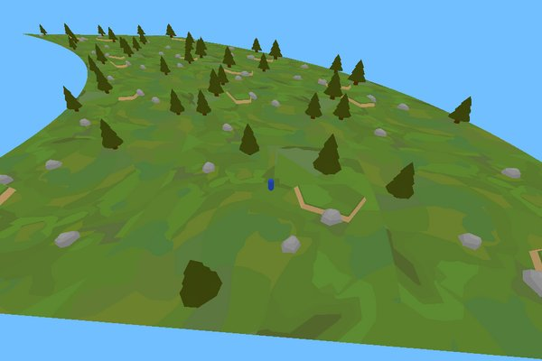

# Curved World

A code library and simple demo of a curved 3D world effect similar to Animal Crossing.

## Features

The main feature of this project is a simple vertex shader that offsets the vertex positions. It takes one vector input to specify the curve settings and another to specify the origin point of the curve (usually the camera position), and both of these can be freely modified at runtime. The code can be easily adapted into other shaders and doesn't affect the fragment shader at all.

Also included are a sample render script, a lua module, and some optional game-object scripts that provide some helpful code for manipulating the shader's inputs and making frustum culling work with the resulting curved vertex positions.

The shader only modifies how things _appear_ on screen. Mechanically, everything is still flat, so physics and everything else is unaffected. Also note that the shader cannot curve edges between vertices, so models may need extra geometry to curve nicely.

Curve only the Z-axis to get an Animal Crossing effect:


Curve both the Z and X axes to get a spherical world:


Or shear the world sideways with distance like some infinite runners do:


## Demo Controls

[Try the demo here](https://rgrams.github.io/defold-curved-world/) or download the repository and run it.

- Click on window to capture cursor and activate mouse look control.
- Press escape or tilde to release cursor capture (needed to drag UI sliders again).
- WASD or arrow keys to move character.
- Mouse wheel to zoom in and out.
- Space to jump.
- Hold Shift to run.
- Hold Left-Ctrl to crouch.
- Page Up and Page Down to adjust curvature on the Z axis (or use UI sliders).
- Home and End to adjust curvature on the X axis (or use UI sliders).
- Backspace to toggle frustum culling on and off.
- Enter to switch the culling frustum between the default camera frustum and an automatically-calculated one based on the current world curvature and the current camera.

Also see [here](https://github.com/rgrams/defold-light-and-shadows-curved/) for a demo of the effect applied to Dragosha's [light and shadows](https://github.com/Dragosha/defold-light-and-shadows) example.

## Usage

You can use this project as a [Library Dependency](https://defold.com/manuals/libraries/#setting-up-library-dependencies) by copying the following URL into your game.project file:

> https://github.com/rgrams/defold-curved-world/archive/refs/heads/master.zip

Or you can download this repository and copy the files you need from the 'curveworld' folder into your project directly.

### Quickstart
_From a blank project._

1. In the "Project" section of your game.project file, add the above link to the "Dependencies". Then click Project > Fetch Libraries. The 'curveworld' folder should appear in the Assets panel.
2. In the "Bootstrap" section of your game.project file, set "Render" to the 'curveworld.render' file.
3. In the main collection, add a game object and add a model component to it. If you don't have your own model, the cube or sphere from the builtins will work fine for testing. Set the material to the 'curve-model.material' file and set a texture (the Defold logo from the builtins works).
4. Add a second game object to the collection, give it a camera component, and move it back on the Z axis so the model will be visible (Z=10 should work).
5. Add a script to the object with the camera with the following contents:
```lua
local curveworld = require "curveworld.curveworld"

function init(self)
	msg.post("@render:", "use_camera_projection")
	msg.post("#camera", "acquire_camera_focus")
	curveworld.set_curve(0.02)
end
```
6. Run the game.

With only one model, the curve effect probably won't be noticeable. To see it better, duplicate your model several times into an array moving away from the camera.

If you start moving the camera around, you will probably want to update the origin of the curve effect to match the camera position. You can use the "curveworld-cam-tracker.script" for this (give it your camera's URL), or do it yourself with one of the origin setting functions (see the API docs below).

### Frustum Culling

Since the shader is changing the position of things and models that would normally be off screen may be moved on screen, the default Frustum culling does not work well. This project also gives you tools to solve this.

The first option is to simply disable frustum culling. Assuming your render script is integrated with curved-world properly, you can call `curveworld.set_culling_enabled(false)` to disable frustum culling.

That's not an ideal solution, so this project allows you to specify your own frustum for culling or have one automatically calculated for you. Use `curveworld.set_cull_frustum()` or `curveworld.set_cull_proj()` to set a custom culling frustum yourself (see API docs below for more details.) Or you can add the 'auto-cull-frustum.script' to an object in your scene and set its "camera" URL property to reference your Camera component, and it will automatically calculate and update the culling frustum every frame.

> Note: The automatically-calculated culling frustum may still cull too much with horizontal shearing active at certain camera angles.

### Custom Render Script Setup

If you want to use your own render script or one provided by someone else, only a few simple modifications are required.

Add at the top of the script, outside any functions, require the curved-world module:
> `local curveworld = require "curveworld.curveworld"`

Inside the init() function, add:
> `curveworld.render_init(self)`

Inside the update() function, _after_ this line:
> `local proj = get_projection(self)`

Add:
> `local draw_options = curveworld.get_draw_options(self, proj)`

After that, when you draw the predicate with models or other objects that use the curved-world material, use `draw_options` instead of the usual table with the culling frustum in it. For example:

```lua
-- Instead of this:
render.draw(self.model_pred, {frustum = frustum})
-- Do this:
render.draw(self.model_pred, draw_options)
```

#### Adding Model Rendering

The default render script does not render models. To enable it, add a predicate for models inside the init() function:

> `self.model_pred = render.predicate({"model"})`

Then, inside update(), set the appropriate settings and draw the predicate:
```lua
render.set_blend_func(render.BLEND_SRC_ALPHA, render.BLEND_ONE_MINUS_SRC_ALPHA)
render.enable_state(render.STATE_CULL_FACE)
render.enable_state(render.STATE_DEPTH_TEST)
render.set_depth_mask(true)
render.draw(self.model_pred, draw_options)
```

## Module API

Require the module to use it:

```lua
local curveworld = require "curveworld.curveworld"
```

### curveworld.get_origin()

Get the center position of the curving effect (usually your camera position) in world-space. Returns x, y, and z.

### curveworld.set_origin(x, y, z)

Set the world-space center position for the curving effect.

### curveworld.update_origin(obj_url)

Sets the center position using an object's local position.

### curveworld.get_curve()

Get the current curve parameters. Returns z, x, and horizontal-shear.

### curveworld.set_curve(z, x, horiz)

Set the strength of the curve effect. `z` is the curve along the Z axis, `x` is the curve along the X axis, and `horiz` is the horizontal shearing effect. Each parameter is only set if it is specified, so you may pass in `nil` or `false` for any parameter to keep its current value.

### curveworld.change_curve(z, x, horiz)

Add values to the current curve strength settings. Like with `curveworld.set_curve()`, settings are only changed if a corresponding value is specified.

### curveworld.render_init(self)

Sets up a constants buffer to pass information to the shader for all models. Call this function from your render script's init function. `self` should be the same `self` that is provided to the init function.

### curveworld.get_draw_options(self)

Returns a table with a culling frustum and a shader constants buffer, to be passed to [`render.draw()`](https://defold.com/ref/stable/render/#render.draw:predicate-[options]) so that the curve settings and origin position will be used for all models.

### curveworld.get_curve_offset(dx, dz)
Calculate the curved vertex offset for a given delta-pos from the origin point. All coordinates are/should be in world space. Note: `dy` is not needed, only `dx` and `dz`. Returns `ox` and `oy`

### curveworld.get_cull_extents(half_width, half_height, far)
Get the estimated necessary extents of the far plane of the culling frustum for the given half-extents of the current camera projection. Returns a new `half_width` and `half_height`.

### curveworld.get_cull_fov(fov, aspect, far)
Get the estimated new field-of-view for a culling frustum based on the settings of the current camera (perspective only of course). Returns a new FoV value.

### curveworld.get_persp_cull_proj(fov, aspect, near, far)
Gets an estimated appropriate culling projection based on the settings of the current perspective camera. Returns a matrix4 which can be passed into `curveworld.set_cull_proj()`.

### curveworld.get_ortho_cull_proj(half_width, half_height, near, far)
Gets an estimated appropriate culling projection based on the settings of the current _orthographic_ camera—assuming the projection is symmetrical. Returns a matrix4 which can be passed into `curveworld.set_cull_proj()`.

> NOTE: Untested.

### curveworld.set_cull_frustum(frustum)
Set a custom frustum matrix to be used for frustum culling. Call without arguments to reset the frustum to the default. The new frustum will always be used until a new one is set (i.e. it doesn't need to be set every frame). Note, the default culling frustum is: projection_matrix * view_matrix.

### curveworld.set_cull_proj(proj)
Set only a custom camera _projection_ to be used for frustum culling, rather than the complete combined projection * view frustum matrix. This will be multiplied with the active camera's view matrix (representing the camera's position & rotation) to get the final culling frustum. If you already set a custom culling frustum with `curveworld.set_cull_frustum()`, then this custom projection will be ignored. Call without arguments to reset the projection to the default.

### curveworld.set_culling_enabled(enabled)
Turn frustum culling on or off. It is enabled by default.

### curveworld.get_culling_enabled()
Get the current enabled status of frustum culling.
